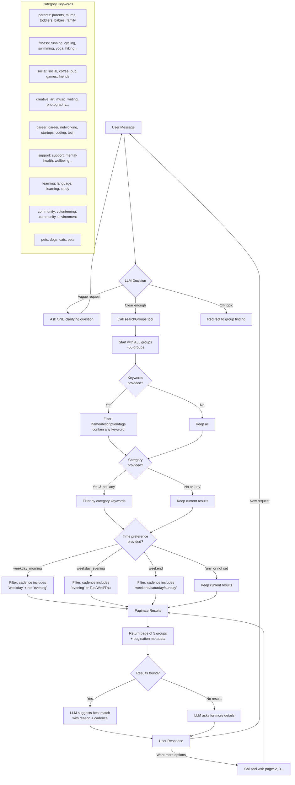

```mermaid
flowchart TD
    A[User Message] --> B{LLM Decision}
    
    B -->|Vague request| C[Ask ONE clarifying question]
    B -->|Clear enough| D[Call searchGroups tool]
    B -->|Off-topic| E[Redirect to group finding]
    
    C --> A
    
    D --> F[Start with ALL groups<br/>~55 groups]
    
    F --> G{Keywords<br/>provided?}
    G -->|Yes| H[Filter: name/description/tags<br/>contain any keyword]
    G -->|No| I[Keep all]
    
    H --> J{Category<br/>provided?}
    I --> J
    
    J -->|Yes & not 'any'| K[Filter by category keywords]
    J -->|No or 'any'| L[Keep current results]
    
    K --> M{Time preference<br/>provided?}
    L --> M
    
    M -->|weekday_morning| N[Filter: cadence includes<br/>'weekday' + not 'evening']
    M -->|weekday_evening| O[Filter: cadence includes<br/>'evening' or Tue/Wed/Thu]
    M -->|weekend| P[Filter: cadence includes<br/>'weekend/saturday/sunday']
    M -->|'any' or not set| Q[Keep current results]
    
    N --> R[Paginate Results]
    O --> R
    P --> R
    Q --> R
    
    R --> S[Return page of 5 groups<br/>+ pagination metadata]
    
    S --> T{Results found?}
    T -->|Yes| U[LLM suggests best match<br/>with reason + cadence]
    T -->|No results| V[LLM asks for more details]
    
    U --> W[User Response]
    V --> W
    
    W -->|Want more options| X[Call tool with page: 2, 3...]
    W -->|New request| A
    X --> R

    subgraph Category Keywords
        direction LR
        CAT1[parents: parents, mums, toddlers, babies, family]
        CAT2[fitness: running, cycling, swimming, yoga, hiking...]
        CAT3[social: social, coffee, pub, games, friends]
        CAT4[creative: art, music, writing, photography...]
        CAT5[career: career, networking, startups, coding, tech]
        CAT6[support: support, mental-health, wellbeing...]
        CAT7[learning: language, learning, study]
        CAT8[community: volunteering, community, environment]
        CAT9[pets: dogs, cats, pets]
    end
```