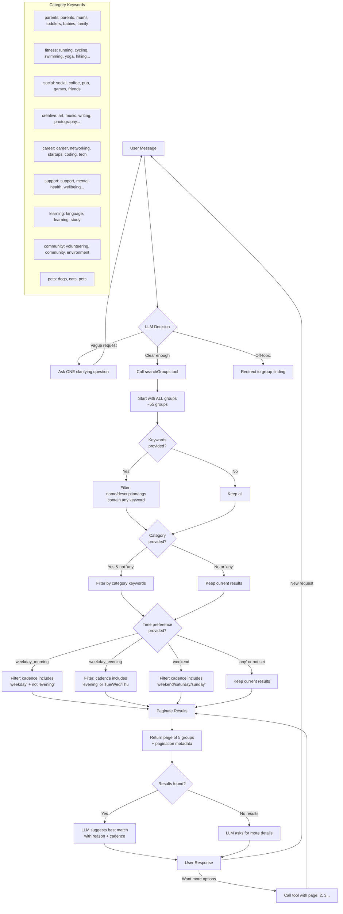

# Neya Technical Test - Group Finding Agent

An AI-powered chat agent that helps people find local groups to join. Built with Next.js, TypeScript, and the Vercel AI SDK.

## Features

- **Multi-turn conversations** - Full conversation history maintained for context
- **Smart clarification** - Asks one focused question when needed, searches immediately when request is clear
- **Tool-based search** - Uses searchGroups tool with keyword, category, and time filters
- **Pagination** - Returns 5 results at a time, LLM can request more pages
- **Content moderation** - OpenAI Moderation API guards against inappropriate input
- **Dual LLM support** - Works with Gemini 2.5 Flash or GPT-4o-mini
- **Evaluation suite** - Automated testing with 10 test cases

## Quick Start

Install dependencies:
```bash
npm install
```

Create `.env.local` with your API key:
```bash
# Option 1: Use Gemini (preferred if both keys present)
GEMINI_API_KEY=your_key_here

# Option 2: Use OpenAI
OPENAI_API_KEY=your_key_here
```

Run the dev server:
```bash
npm run dev
```

Open [http://localhost:3000](http://localhost:3000) and start chatting.

## Project Structure

```
lib/
  agent.ts         - Main agent orchestration
  llm.ts           - LLM provider abstraction (Gemini/OpenAI)
  prompt.ts        - System prompt defining agent behavior
  tools.ts         - searchGroups tool with filters
  mockGroups.ts    - In-memory group database (~55 groups)
  moderation.ts    - OpenAI moderation guardrails
  types.ts         - TypeScript types

components/
  Chat.tsx         - Chat UI component

app/
  api/chat/
    route.ts       - API endpoint for chat requests

scripts/
  evaluate.ts      - Evaluation script (run with: npm run eval)
```

## How It Works

User sends message → Chat.tsx → /api/chat → agent.ts checks moderation → llm.ts processes with tools → searchGroups filters groups → LLM suggests best match

## Matching Logic Flow



## Testing

Run the evaluation suite:
```bash
npm run eval
```

Tests 10 scenarios across 4 categories:
- Correctness - Only suggests real groups
- Ambiguity handling - Asks one clarifying question when needed
- Search quality - Handles messy/informal text
- Reliability - Handles edge cases and off-topic requests

## Key Design Decisions

**In-memory state** - Conversations reset on refresh. Simple, no database needed. Production would use persistent storage.

**Keyword search** - Fast and predictable. Doesn't understand semantic similarity (e.g., "chill" won't match "relaxed"). Production would use embeddings.

**Prompt-based clarification** - Flexible, easy to tune. Relies on LLM following instructions. More deterministic approach would use structured output.

**GPT-4o-mini** - Cost-effective but sometimes ignores complex instructions (e.g., asks compound questions). Gemini 2.5 Flash is alternative.

See NOTES.md for detailed trade-offs and improvement roadmap.

## Tech Stack

- Next.js 15 (App Router)
- TypeScript
- Vercel AI SDK
- OpenAI / Gemini
- Tailwind CSS
- Zod (schema validation)